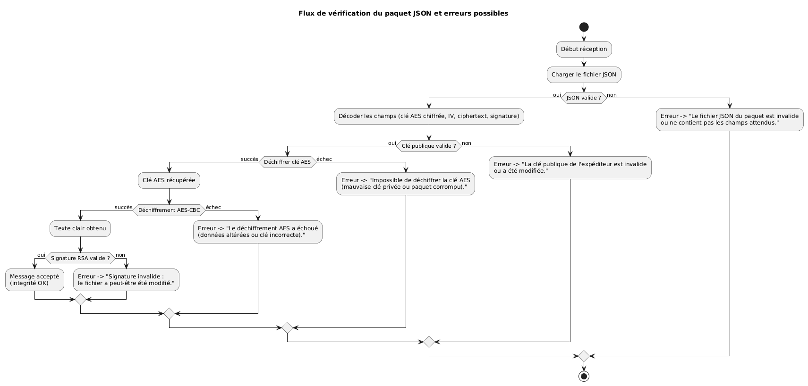

# Mini-projet : Échange sécurisé de fichier

Ce dépôt illustre un échange de fichier confidentiel entre deux personnes.  
Le flux garantit intégrité, authenticité, confidentialité et non-répudiation grâce à :
- **RSA-2048** (signature + chiffrement de la clé AES),
- **AES-128-CBC** (chiffrement du fichier),
- **SHA-256** (empreintes numériques),
- **PyCryptodome** (implémentation des primitives).

---

## 1. Préparation de l’environnement
- Installer Python 3.10 ou supérieur.
- Installer la dépendance principale :
  ```
  pip install -r requirements.txt
  ```

---

## 2. Génération des paires RSA
```
python src/generate_keys.py --output-dir keys --prefix binomeA
```
Arguments utiles :
- `--passphrase` : protège la clé privée via PKCS#8 + scrypt + AES128.

Le script produit deux fichiers PEM dans `keys/` :
- `binomeA_private.pem`
- `binomeA_public.pem`

Répéter l’opération pour le destinataire (`--prefix binomeB`).

> L’interface interactive (`src/main.py`) régénère automatiquement les clés manquantes en conservant la convention `_private.pem` / `_public.pem`.

---

## 3. Envoi du fichier (binôme A)

### 3.1 Version script classique
```
python src/sign_encrypt.py ^
  --input message.txt ^
  --sender-private-key keys/binomeA_private.pem ^
  --recipient-public-key keys/binomeB_public.pem ^
  --output message_secure.json
```

### 3.2 Version interactive
```
python src/main.py ^
  --sender-private-key keys/binomeA_private.pem ^
  --recipient-public-key keys/binomeB_public.pem ^
  --package message_secure.json
```
Le script demande un nom de fichier puis le contenu (terminer par `EOF`).  
Option `--save-plaintext` pour conserver une copie locale du texte saisi.

### 3.3 Contenu du paquet JSON généré
`message_secure.json` regroupe :
- la signature RSA (PKCS#1 v1.5 / SHA-256) du fichier original,
- la clé AES-128 chiffrée via RSA-OAEP,
- le vecteur d’initialisation AES-CBC,
- le ciphertext AES,
- le nom de fichier et des métadonnées sur les algorithmes utilisés.

---

## 4. Réception et vérification (binôme B)
```
python src/verify_decrypt.py ^
  --package message_secure.json ^
  --recipient-private-key keys/binomeB_private.pem ^
  --sender-public-key keys/binomeA_public.pem
```
Options :
- `--output chemin.txt` pour choisir un emplacement différent.
- `--passphrase` si la clé privée destinataire est protégée.

Le script :
1. vérifie la structure du JSON,
2. déchiffre la clé AES (RSA-OAEP),
3. déchiffre le fichier (AES-128-CBC),
4. valide la signature RSA.

Chaque étape renvoie un message explicite en cas d’échec (clé incorrecte, JSON modifié, signature invalide, etc.).

---

## 5. Diagramme de flux et gestion des erreurs

Le rendu de `docs/secure_flow.puml` est disponible dans `docs/diagram1.png`.
Il décrit les contrôles réalisés côté destinataire et les erreurs émises lorsque le paquet JSON a été altéré.



Pour regénérer l’image :
```
plantuml -tpng docs/secure_flow.puml
```

---

## 6. Structure du dépôt
- `requirements.txt` : dépendance PyCryptodome.
- `src/crypto_utils.py` : fonctions communes (RSA, AES, signature, structure JSON).
- `src/generate_keys.py` : génération des paires RSA-2048.
- `src/sign_encrypt.py` : signature et chiffrement hybride côté expéditeur.
- `src/main.py` : variante interactive avec génération automatique des clés manquantes.
- `src/verify_decrypt.py` : déchiffrement + vérification des signatures côté destinataire avec gestion d’erreurs détaillée.
- `docs/secure_flow.puml` : diagramme PlantUML.
- `docs/diagram1.png` : rendu PNG du diagramme.

---

## 7. Scénario de démonstration rapide
1. `python src/generate_keys.py --output-dir keys --prefix binomeA`
2. `python src/generate_keys.py --output-dir keys --prefix binomeB`
3. Préparer `message.txt` avec le contenu à envoyer.
4. Exécuter `src/sign_encrypt.py` (ou `src/main.py`) pour produire `message_secure.json`.
5. Transmettre `message_secure.json` + la clé publique de l’expéditeur au destinataire.
6. Côté destinataire, exécuter `src/verify_decrypt.py` pour retrouver le message clair.

> Le message final n’est accepté que si la structure JSON est valide, la clé AES est déchiffrable, le fichier AES-CBC est cohérent et la signature RSA correspond.

---

## 8. Pour la documentation PDF
- Rappeler les objectifs de sécurité (confidentialité, intégrité, authenticité, non-répudiation).
- Présenter les algorithmes utilisés (RSA, OAEP, PKCS#1 v1.5, AES-CBC, SHA-256).
- Insérer des captures des commandes principales.
- Décrire le format de `message_secure.json` et le flux du diagramme PlantUML.
- Inclure les scripts (ou extraits) et expliquer le rôle de chaque module Python.
